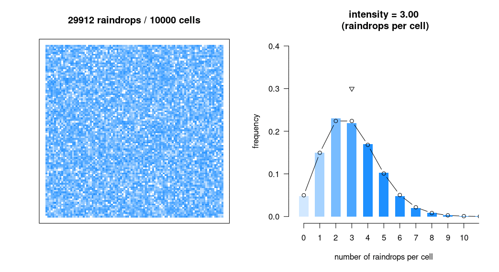

# some notes on poisson processes

*Bret Beheim*

*3 June 2022*

A Poisson random variable $X$ is a count variable (0, 1, ...) following the probability function:

$$
Pr(X = k) = \frac{e^{-\lambda} \lambda^k}{k!}
$$

Using a poisson random variable in R:

```r

x <- rpois(n = 100, lambda = 1.3)

mean(x) # theoretically equal to lambda
var(x) # theoretically equal to lambda

round(dpois(0:6, lambda = 1.3), 2) # theoretical probabilities of 0 to 6
prop.table(table(x)) # empirical frequencies

```


## The Poisson process

In the Poisson process, the number of events $N(t)$ within a continuous interval $t$ (which could be an interval of time or space) is Poisson-distributed with some rate $\lambda t$. Usually the individual entities counted in $N$ are *arrivals*, which have specific *arrival times*.

Instructions for simulating a PP using a fixed length of time:
1. fix `t` total duration, and `lambda`
2. generate `n_arrivals` using `rpois`
3. generate the `arrival_times` as Uniform over `0` to `t`

```r

t <- 10 # total duration, in seconds
lambda <- 1.3 # arrivals per second
n_arrivals <- rpois(1, lambda = (lambda * t))
arrival_times <- sort(runif(n_arrivals, 0, t))

```

In a PP, each moment in time has an *equal* chance of the arrival occurrance.

Instructions for simulating a PP using a fixed number of arrivals:
1. fix `n_arrivals`, and `lambda`
2. generate inter-arrival times using `rexp`
3. calculate the arrival times as the accumulation of the inter-arrival times

```r

n_arrivals <- 12
lambda <- 1.3 # arrivals per second
inter_arrival_times <- rexp(n_arrivals, rate = lambda)
arrival_times <- cumsum(inter_arrival_times)
t <- max(arrival_times)

```

Create a large number of simulated PP's with fixed `n_arrivals`

```r


ts <- replicate(10000, {
  n_arrivals <- 12
  lambda <- 1.3 # arrivals per second
  inter_arrival_times <- rexp(n_arrivals, rate = lambda)
  arrival_times <- cumsum(inter_arrival_times)
  t <- max(arrival_times)
  return(t)
})

```

The $j$ th arrival in a PP occurs at time $T_j \sim \mathrm{Gamma}(j, \lambda)$.


## Poisson Scatter

A PP can also describe distributions in space! In the script `poisson-scatter.R`, we create a count of $N$ raindrops from a Poisson($\lambda D$) distribution, and scatter each of them randomly across a square grid of $D$ cells. The spatial distribution for any raindrop is uniform, but the count of the number of hits in any specific cell follows a Poisson($\lambda$) distribution, in the same way the counts of arrivals in any interval of time in a PP is Poisson distributed.


As we increase the number of cells, the ensemble distribution of counts converges to a Poisson:





## Poisson Superposition

Two or more Poisson processes occuring during the same interval (of time, space, etc.) can be combined into a *single* Poisson process which has as a rate, the sum of the rates of each contributing PP.

```r

t <- 10 # duration in seconds

lambda1 <- 0.5
n_arrivals1 <- rpois(1, lambda1 * t)
arrival_times1 <- sort(runif(n_arrivals1, 0, t))

lambda2 <- 1.2
n_arrivals2 <- rpois(1, lambda2 * t)
arrival_times2 <- sort(runif(n_arrivals2, 0, t))

# functionally this is identical to a PP over t with rate (lambda1 + lambda2)

lambda <- lambda1 + lambda2
n_arrivals <- n_arrivals1 + n_arrivals2
arrival_times <- sort(c(arrival_times1, arrival_times2))

```


## Poisson Thinning

A single Poisson process with rate $\lambda$ can be sorted ("thinned") into two or more different Poisson processes. For example, arrivals can be either "left" or "right" arrivals and "right" arrivals occur with frequency $p$. Then, the "right" arrivals can have their own Poisson process with rate $\lambda_r = (1 - p) \lambda$, and the "right" arrivals have their own Poisson process with rate $\lambda_r = p \lambda$.

```r

t <- 10 # duration in seconds
lambda <- 1.7 # arrivals per second
pr_right <- 0.8 # probability any specific arrival will be a 'right'
n_arrivals <- rpois(1, t * lambda)
arrival_times <- sort(runif(n_arrivals, 0, t))
is_right <- rbinom(n_arrivals, 1, pr_right)

# the 'right' poisson process is identical to a PP with pr_right * lambda

lambda_right <- pr_right * lambda 
n_arrivals_right <- sum(is_right)
arrival_times_right <- arrival_times[which(is_right == 1)]

lambda_left <- (1 - pr_right) * lambda 
n_arrivals_left <- sum(!is_right)
arrival_times_left <- arrival_times[which(is_right != 1)]

```

A very useful property of thinning is, the probability any specific arrival will be a "left" is simply the rate of "left" relative to the aggregate rate: 

$$
\frac{\lambda_l}{\lambda_r + \lambda_l}.
$$

Thinning and super-position generalize to combining or separating an arbitrary number of sub-processes.


## Gamma-Poisson Conjugacy

In observing arrivals from a Poisson process empirically, we don't know the true rate $\lambda$, and so have to estimate them. One useful property for Bayesian estimation is Gamma-Poisson conjugacy: if we assume $\lambda \sim \mathrm{Gamma}(a, b)$, and observe $n$ arrivals in $t$ units of time, the *conditional* distribution of $\lambda$ follows a $\mathrm{Gamma}(a + n, b + t)$ distribution.

```r

library(rethinking)

lambda_true <- 1.2
t <- 10 # duration in seconds
n_arrivals <- rpois(1, t * lambda_true)
lambda_posterior <- rgamma(10000, 5 + n_arrivals, 3 + t) # for a Gamma(5, 3) prior
mean(lambda_posterior) # compare with lambda_true
HPDI(lambda_posterior)

curve(dgamma(x, 5 + n_arrivals, 3 + t), from = 0, to = 3)
abline(v = lambda_true, lty = 2, col = "red")
curve(dgamma(x, 5, 3), add = TRUE, lty = 2)

```

In observing data a Poisson super-position, in which we see arrivals and can categorize them into specific "types", we can estimate the posteriors for each contributing process, and then calculate the estimated probability an arrival will belong to any specific process by the rate of that one process divided by the aggregated rate, as above.
